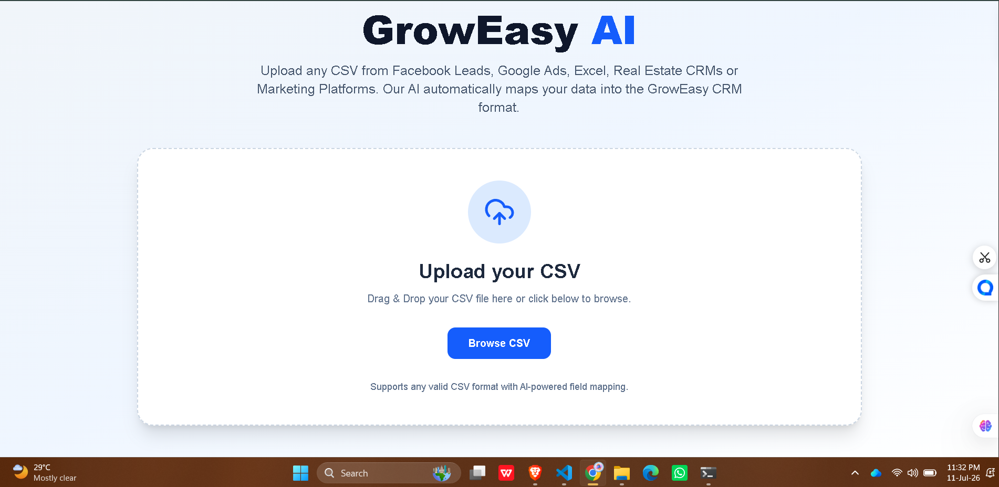
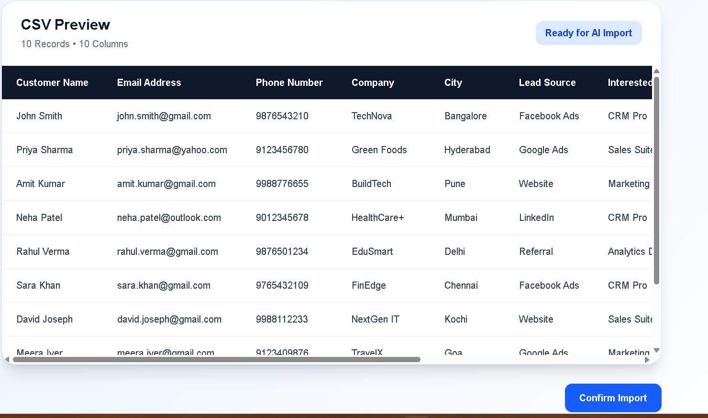
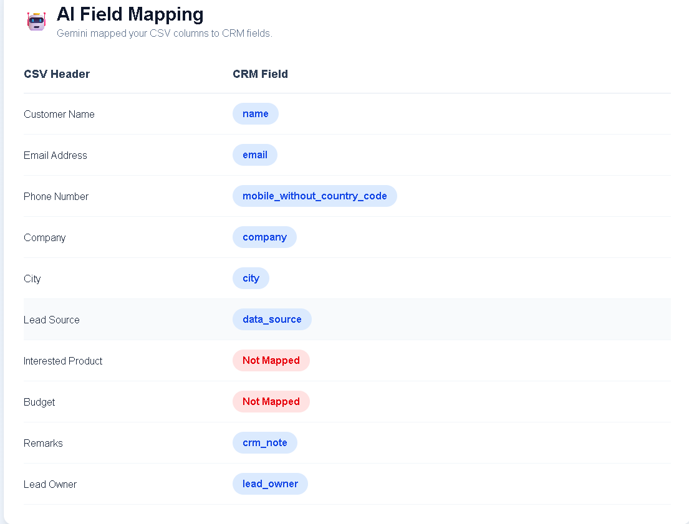
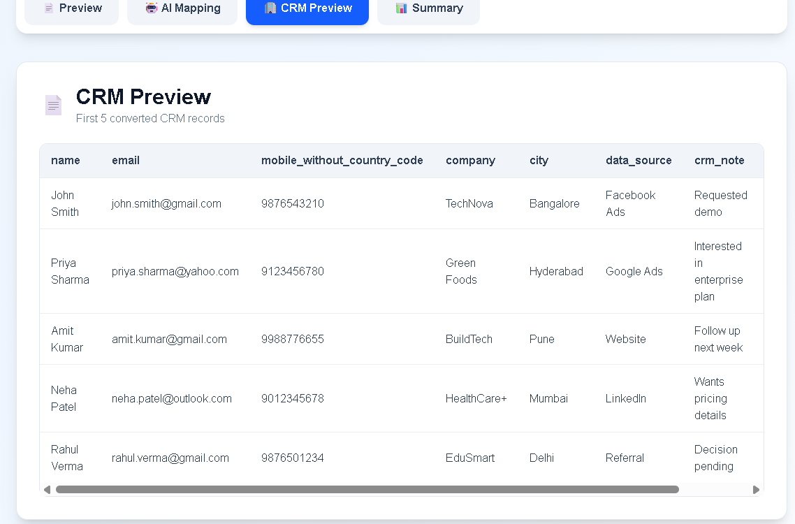
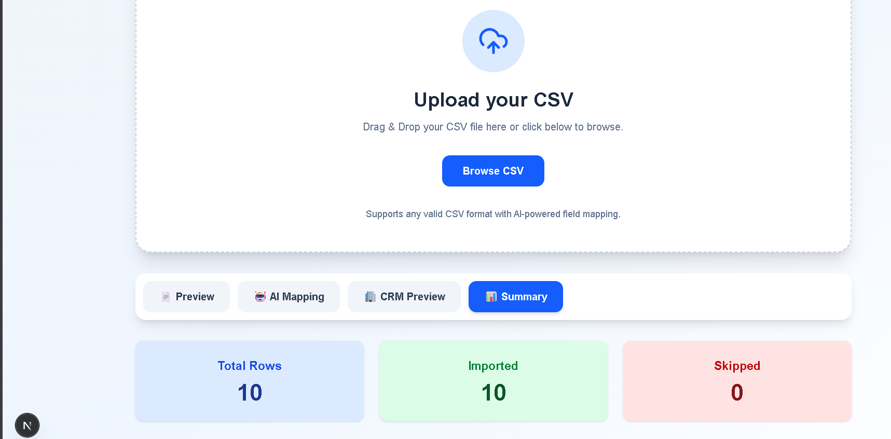

# 🚀 GrowEasy AI CSV Importer

An AI-powered CSV Importer that intelligently maps CSV files with different column names and structures into the GrowEasy CRM format using Google's Gemini AI.

---

## 🌐 Live Demo

### Frontend
https://groweasy-ai-importer-three.vercel.app/

### Backend API
https://groweasy-ai-importer-api-97s9.onrender.com/

---

## 📂 GitHub Repository

https://github.com/Mariyam-760/groweasy-ai-importer

---

## ✨ Features

- 📤 Drag & Drop CSV Upload
- 📁 File Picker Support
- 📄 CSV Preview Before Import
- 🤖 AI-powered Header Mapping using Gemini
- 🏢 CRM Record Preview
- 📊 Import Summary Dashboard
- ⚠️ Skip Invalid Records (Missing Email & Phone)
- ⏳ Loading State During AI Processing
- ❌ Friendly Error Handling
- 📱 Responsive User Interface

---

## 🧠 AI Workflow

1. Upload any valid CSV file.
2. Preview the CSV before processing.
3. Click **Confirm Import**.
4. Backend sends CSV headers to Gemini AI.
5. Gemini maps CSV columns to GrowEasy CRM fields.
6. Backend converts rows into CRM format.
7. Invalid rows are skipped.
8. Converted CRM records are displayed to the user.

---

## 🛠 Tech Stack

### Frontend
- Next.js
- React
- TypeScript
- Tailwind CSS
- Axios

### Backend
- Node.js
- Express
- TypeScript

### AI
- Google Gemini API

### Deployment
- Vercel
- Render

---

## 📸 Screenshots

### Home Page



---

### CSV Preview



---

### AI Header Mapping



---

### CRM Preview



---

### Import Summary



---

## 📂 Project Structure

```
groweasy-ai-importer/
│
├── frontend/
│   ├── src/
│   └── ...
│
├── backend/
│   ├── src/
│   └── ...
│
└── README.md
```

---

## ⚙️ Local Setup

### Clone Repository

```bash
git clone https://github.com/Mariyam-760/groweasy-ai-importer.git
```

---

### Backend

```bash
cd backend
npm install
npm run dev
```

---

### Frontend

```bash
cd frontend
npm install
npm run dev
```

---

## 🎯 Assignment Objectives Covered

- ✅ CSV Upload
- ✅ CSV Preview
- ✅ AI Header Mapping
- ✅ CRM Record Extraction
- ✅ Import Summary
- ✅ Skip Invalid Records
- ✅ Error Handling
- ✅ Loading State
- ✅ Responsive UI
- ✅ Deployment

---

## 👩‍💻 Author

**Safa Mariyam**